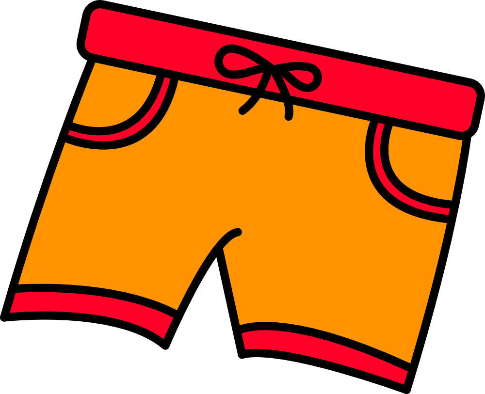

   

# ShortyURLShortener
A simple URL shortener that works on MacOSX Menu Bar.

Usage:
<ol>
  <li>Run the program</li>
  <li>Copy the long URL</li>
  <li>Choose the preffered shortener service.</li>
  <li>Click "Shorten!"</li>
  <li>Shortened URL should copied to clipboard</li>
</ol>

Used Libraries:
<ul>
  <li>Rumps: https://github.com/jaredks/rumps</li>
  <li>Pyshorteners: https://github.com/ellisonleao/pyshorteners</li>
  <li>Clipboard: https://github.com/terryyin/clipboard</li>
  <li>Validators: https://github.com/kvesteri/validators</li>
</ul>

Recommendations:

If you have a prefferen shortener which is supported by pyshorteners be sure to implement your credentials in order to use that service.
Using py2app library it is possible create an application, which could be useful for running the application on startup.
